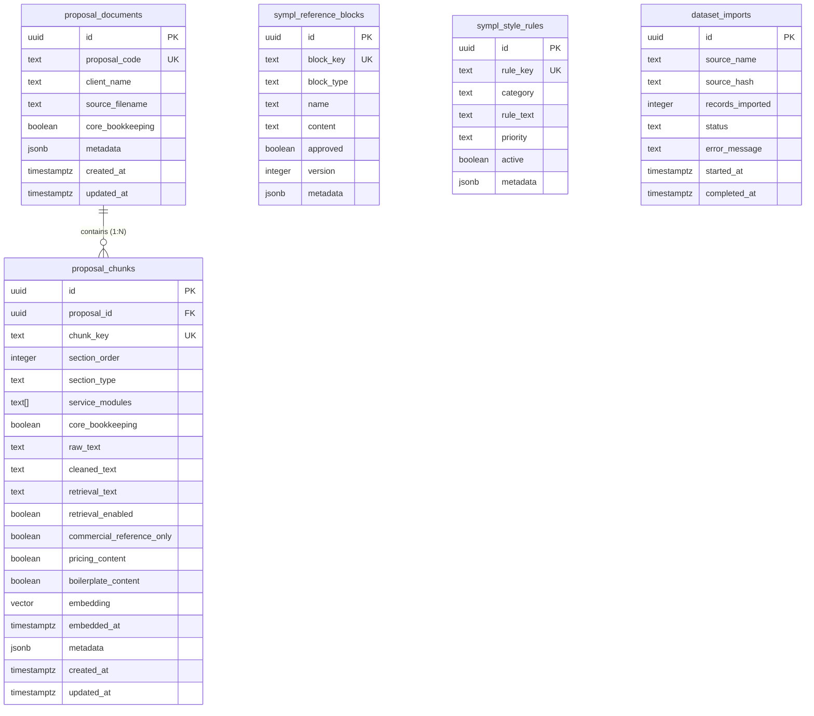

# Sympl Proposal RAG — Database Schema Specification

This document provides architectural documentation for the dedicated PostgreSQL + pgvector schema supporting automated proposal generation for Sympl Solutions.

---

> [!IMPORTANT]
> ### CORE ARCHITECTURAL INVARIANTS
> 
> 1. **NORMAL RAG RETRIEVAL RULE**:
>    `proposal_chunks` used for semantic content retrieval must normally have:
>    ```text
>    retrieval_enabled = TRUE
>    ```
>    The RAG retriever will primarily search `proposal_chunks`.
> 
> 2. **HISTORICAL PRICING SAFETY & RETENTION**:
>    Historical pricing rows must satisfy:
>    ```text
>    pricing_content = TRUE
>    commercial_reference_only = TRUE
>    retrieval_enabled = FALSE
>    ```
>    **HISTORICAL PRICES MUST NOT BE USED TO GENERATE, INFER, INTERPOLATE, OR RECOMMEND NEW PRICES.**
>    Historical pricing is **NOT deleted**. It is retained as controlled commercial reference material to study presentation formatting, fee schedules, and scope-exclusion language. It is strictly excluded from participating in semantic RAG retrieval (`retrieval_enabled = FALSE`).
> 
> 3. **HISTORICAL BOILERPLATE SAFETY**:
>    Historical boilerplate rows must satisfy:
>    ```text
>    boilerplate_content = TRUE
>    retrieval_enabled = FALSE
>    ```
>    **APPROVED REFERENCE BLOCKS ARE NOT ORDINARY RAG DOCUMENTS.**
>    Approved reusable boilerplate belongs in `sympl_reference_blocks` (e.g., standard software exclusions, bookkeeping backlog exclusions, "Why Sympl" introductions, client responsibilities). Reusable boilerplate must be inserted deterministically, not fuzzy-matched via semantic RAG similarity.
> 
> 4. **STYLE RULES ARE NOT ORDINARY RAG DOCUMENTS**:
>    `sympl_style_rules` contains meta-instructions regarding tone, structure, syntax, and operational boundaries. They are not searched via vector embeddings; they are retrieved deterministically and injected directly into system and task prompts.

---

## 1. Schema Overview & Entity Relationships



---

## 2. Table Specifications

### 2.1. `proposal_documents`
Represents an entire historical proposal as an immutable document entity.

- **`id`** (`UUID`, PK, `DEFAULT gen_random_uuid()`): Unique document identifier.
- **`proposal_code`** (`TEXT`, NOT NULL, UNIQUE): Unique business code (e.g., `"TACT_2026"`).
- **`client_name`** (`TEXT`, NOT NULL): Full client organization name.
- **`proposal_title`** (`TEXT`): Title on proposal cover.
- **`proposal_date`** (`DATE`): Issuance date.
- **`source_filename`** (`TEXT`, NOT NULL): Reference to immutable raw document in `data/raw/`.
- **`organization_type`** (`TEXT`): Classification (e.g., `charity`, `nonprofit`, `social_enterprise`).
- **`sector`** (`TEXT`): Operational sector (e.g., `arts_culture`, `social_services`).
- **`engagement_type`** (`TEXT`): Engagement model (e.g., `ongoing`, `cleanup`, `transformation`).
- **`proposal_complexity`** (`TEXT`): Subjective or structured complexity rating.
- **`core_bookkeeping`** (`BOOLEAN`, NOT NULL, DEFAULT `TRUE`): Flags whether standard general ledger services are included.
- **`raw_text`** (`TEXT`): Complete unedited text extraction of source document.
- **`cleaned_text`** (`TEXT`): Canonical cleaned text of document.
- **`metadata`** (`JSONB`, NOT NULL, DEFAULT `'{}'::jsonb`): Extensible metadata.
- **`created_at`** / **`updated_at`** (`TIMESTAMPTZ`, NOT NULL, DEFAULT `NOW()`): Audit timestamps.

---

### 2.2. `proposal_chunks`
The fundamental retrieval unit. Each row represents a semantic section or modular service block.

- **`id`** (`UUID`, PK, `DEFAULT gen_random_uuid()`): Unique chunk identifier.
- **`proposal_id`** (`UUID`, NOT NULL, FK `REFERENCES proposal_documents(id) ON DELETE CASCADE`): Parent proposal relationship.
- **`chunk_key`** (`TEXT`, NOT NULL, UNIQUE): Globally unique chunk key (e.g., `"TACT_2026_CONTEXT_OBJECTIVES"`).
- **`section_order`** (`INTEGER`): 1-based sequential position in document.
- **`section_type`** (`TEXT`, NOT NULL): Semantic section type (e.g., `scope`, `service_module`, `pricing`).
- **`section_title`** (`TEXT`): Header or title of the section.
- **`service_modules`** (`TEXT[]`, NOT NULL, DEFAULT `'{}'::text[]`): Specific service areas covered (e.g., `payroll`, `reconciliations`).
- **`organization_type`** (`TEXT`): Client entity type.
- **`sector`** (`TEXT`): Client industry or sector.
- **`engagement_type`** (`TEXT`): Engagement structure.
- **`core_bookkeeping`** (`BOOLEAN`, NOT NULL, DEFAULT `FALSE`): Indicates whether this chunk describes baseline bookkeeping.
- **`accounting_systems`** (`TEXT[]`, NOT NULL, DEFAULT `'{}'::text[]`): Accounting tools cited (e.g., `["QuickBooks Online"]`).
- **`payroll_systems`** (`TEXT[]`, NOT NULL, DEFAULT `'{}'::text[]`): Payroll platforms cited (e.g., `["ADP"]`).
- **`cadence`** (`TEXT[]`, NOT NULL, DEFAULT `'{}'::text[]`): Frequency terms (e.g., `["monthly"]`).
- **`special_requirements`** (`TEXT[]`, NOT NULL, DEFAULT `'{}'::text[]`): Special terms (e.g., `["funder_reporting_t3010"]`).
- **`raw_text`** (`TEXT`, NOT NULL): Verbatim historical source text.
- **`cleaned_text`** (`TEXT`, NOT NULL): Cleaned canonical text preserving tone and syntax.
- **`retrieval_text`** (`TEXT`, NOT NULL): Text representation prepared for vector embedding.
- **`retrieval_enabled`** (`BOOLEAN`, NOT NULL, DEFAULT `TRUE`): Master switch for semantic search indexing.
- **`commercial_reference_only`** (`BOOLEAN`, NOT NULL, DEFAULT `FALSE`): Marks content restricted from dynamic scope drafting.
- **`pricing_content`** (`BOOLEAN`, NOT NULL, DEFAULT `FALSE`): Identifies pricing tables, rates, and fee quotes.
- **`boilerplate_content`** (`BOOLEAN`, NOT NULL, DEFAULT `FALSE`): Identifies standard boilerplate text.
- **`embedding`** (`VECTOR`): Dense embedding vector (dimension unconstrained until model selection).
- **`embedded_at`** (`TIMESTAMPTZ`): Timestamp when embedding was computed.
- **`metadata`** (`JSONB`, NOT NULL, DEFAULT `'{}'::jsonb`): Open metadata.
- **`created_at`** / **`updated_at`** (`TIMESTAMPTZ`, NOT NULL, DEFAULT `NOW()`): Audit timestamps.

#### Table Constraints:
```sql
-- Pricing Safety Constraint:
-- When pricing_content is true, commercial_reference_only must be true AND retrieval_enabled must be false.
CONSTRAINT chk_pricing_safety CHECK (
    NOT pricing_content
    OR (
        commercial_reference_only
        AND NOT retrieval_enabled
    )
),

-- Boilerplate Retrieval Safety Constraint:
-- When boilerplate_content is true, retrieval_enabled must be false.
CONSTRAINT chk_boilerplate_retrieval CHECK (
    NOT boilerplate_content
    OR NOT retrieval_enabled
),

-- Section Order Sanity Constraint:
CONSTRAINT chk_proposal_chunks_section_order CHECK (
    section_order IS NULL
    OR section_order >= 0
)
```

---

### 2.3. `sympl_reference_blocks`
Repository of approved, version-controlled Sympl boilerplate blocks.

- **`id`** (`UUID`, PK, `DEFAULT gen_random_uuid()`): Unique identifier.
- **`block_key`** (`TEXT`, NOT NULL, UNIQUE): Reference key (e.g., `"standard_exclusion_software_subscriptions"`).
- **`block_type`** (`TEXT`, NOT NULL): Category (e.g., `why_us`, `standard_exclusion`, `client_responsibility`).
- **`name`** (`TEXT`, NOT NULL): Human-readable name.
- **`content`** (`TEXT`, NOT NULL): Canonical markdown/text content.
- **`approved`** (`BOOLEAN`, NOT NULL, DEFAULT `FALSE`): Management approval flag.
- **`version`** (`INTEGER`, NOT NULL, DEFAULT `1`): Incremental version number.
- **`metadata`** (`JSONB`, NOT NULL, DEFAULT `'{}'::jsonb`): Contextual metadata.
- **`created_at`** / **`updated_at`** (`TIMESTAMPTZ`, NOT NULL, DEFAULT `NOW()`): Timestamps.

#### Table Constraints:
```sql
CONSTRAINT chk_sympl_reference_blocks_version CHECK (version >= 1)
```

---

### 2.4. `sympl_style_rules`
Persistent Sympl instructions, tone controls, syntax patterns, and scope boundaries.

- **`id`** (`UUID`, PK, `DEFAULT gen_random_uuid()`): Unique identifier.
- **`rule_key`** (`TEXT`, NOT NULL, UNIQUE): Unique rule key (e.g., `"tone_canadian_accounting_terms"`).
- **`category`** (`TEXT`, NOT NULL): Category (e.g., `tone`, `syntax`, `scope`, `factuality`, `commercial`).
- **`rule_text`** (`TEXT`, NOT NULL): Instruction to be passed into LLM system or task prompts.
- **`priority`** (`TEXT`, NOT NULL): Priority level (`normal`, `high`, `critical`).
- **`active`** (`BOOLEAN`, NOT NULL, DEFAULT `TRUE`): Enablement toggle.
- **`metadata`** (`JSONB`, NOT NULL, DEFAULT `'{}'::jsonb`): Metadata.
- **`created_at`** / **`updated_at`** (`TIMESTAMPTZ`, NOT NULL, DEFAULT `NOW()`): Timestamps.

---

### 2.5. `dataset_imports`
Tracks all dataset ingestion jobs for traceability, provenance, and idempotency.

- **`id`** (`UUID`, PK, `DEFAULT gen_random_uuid()`): Ingestion run ID.
- **`source_name`** (`TEXT`, NOT NULL): Filename of the imported dataset (e.g., `"TACT_2026.json"`).
- **`source_hash`** (`TEXT`): SHA-256 hex digest of the imported JSON file.
- **`records_imported`** (`INTEGER`, NOT NULL, DEFAULT `0`): Count of entities inserted/updated.
- **`status`** (`TEXT`, NOT NULL): Status (`started`, `completed`, `failed`, `skipped`).
- **`error_message`** (`TEXT`): Details if failed.
- **`started_at`** (`TIMESTAMPTZ`, NOT NULL, DEFAULT `NOW()`): Start time.
- **`completed_at`** (`TIMESTAMPTZ`): Completion time.

#### Table Constraints:
```sql
CONSTRAINT chk_dataset_imports_records_imported CHECK (records_imported >= 0)
```

---

## 3. Database Indexes

### B-Tree Indexes (Relational Filtering & Joins)
- `proposal_chunks(proposal_id)`: Foreign key joins between documents and chunks.
- `proposal_chunks(section_type)`: Filtering by section classification.
- `proposal_chunks(organization_type)`: Filtering by client structure.
- `proposal_chunks(sector)`: Industry-specific filtering.
- `proposal_chunks(engagement_type)`: Engagement structure filtering.
- `proposal_chunks(retrieval_enabled)`: Excluding disabled chunks from search candidate pools.
- `proposal_chunks(pricing_content)`: Explicitly isolating or bypassing pricing.
- `proposal_chunks(core_bookkeeping)`: Segmenting core ledger operations from advisory work.
- `dataset_imports(source_hash)`: Ingestion hash lookups.
- `dataset_imports(status)`: Ingestion status lookups.

### Partial Unique Index (Ingestion Idempotency)
- `dataset_imports(source_name, source_hash) WHERE status = 'completed' AND source_hash IS NOT NULL`: Prevents accidental duplicate completed imports for identical file contents, even during concurrent executions.

### GIN Indexes (Array & JSONB Containment)
PostgreSQL GIN (Generalized Inverted Index) indexes enable high-speed array containment queries (`@>` / `&&`):
- `proposal_chunks USING GIN (service_modules)`: Find all chunks containing specific service tags (e.g., `service_modules @> ARRAY['payroll']`).
- `proposal_chunks USING GIN (accounting_systems)`: Match on software infrastructure (`accounting_systems @> ARRAY['QuickBooks Online']`).
- `proposal_chunks USING GIN (payroll_systems)`: Match on payroll platforms.
- `proposal_chunks USING GIN (cadence)`: Match on delivery frequency.
- `proposal_chunks USING GIN (special_requirements)`: Match on client compliance constraints.
- `proposal_chunks USING GIN (metadata)`: JSONB path querying.
- `proposal_documents USING GIN (metadata)`: JSONB path querying.

---

## 4. Why the Embedding Dimension is Currently Unspecified

In PostgreSQL pgvector, `VECTOR` without a dimension specification (e.g., `embedding VECTOR` rather than `embedding VECTOR(1536)`) defines an unconstrained vector column.

**Rationale**:
1. **Model Evaluation Pending**: The embedding model has not yet been selected (e.g., OpenAI `text-embedding-3-small` [1536], `text-embedding-3-large` [3072], Google Gemini `text-embedding-004` [768], or open-source BAAI/BGE/Cohere models).
2. **Migration Agility**: By keeping the column unconstrained in Phase 1B, the database foundation does not need to be rebuilt or migrated when the embedding model is benchmarked during subsequent phases.
3. **Locking Strategy**: The dimension will be permanently locked via an `ALTER TABLE proposal_chunks ALTER COLUMN embedding TYPE vector(N);` migration only after benchmarking accuracy on the historical Sympl proposal dataset.

---

## 5. Why No HNSW or IVFFlat Index is Created Yet

1. **Dataset Scale**: The historical proposal dataset currently consists of seven core proposals. Even when fully chunked into granular semantic sections, the corpus will contain on the order of tens to hundreds of chunks.
2. **Exact Search Superiority**: For datasets under tens of thousands of rows, exact nearest-neighbor search (`ORDER BY embedding <=> query_vector LIMIT k`) performs sequential scans in single-digit milliseconds with **100% recall**, completely avoiding the recall degradation of Approximate Nearest Neighbor (ANN) indexes.
3. **Index Dimension Dependency**: In pgvector, HNSW and IVFFlat indexes require the column to have a fixed, known dimension at index creation time. Attempting to build an index on an unconstrained `VECTOR` column would be premature.
4. **Conclusion**: ANN indexes (HNSW) will be introduced in future phases when corpus volume justifies approximate index maintenance.
