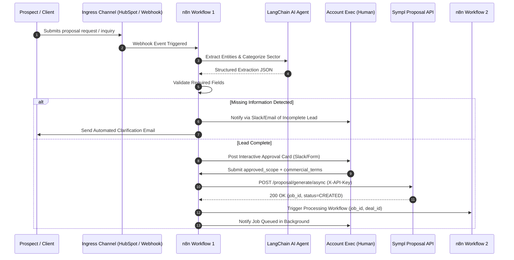
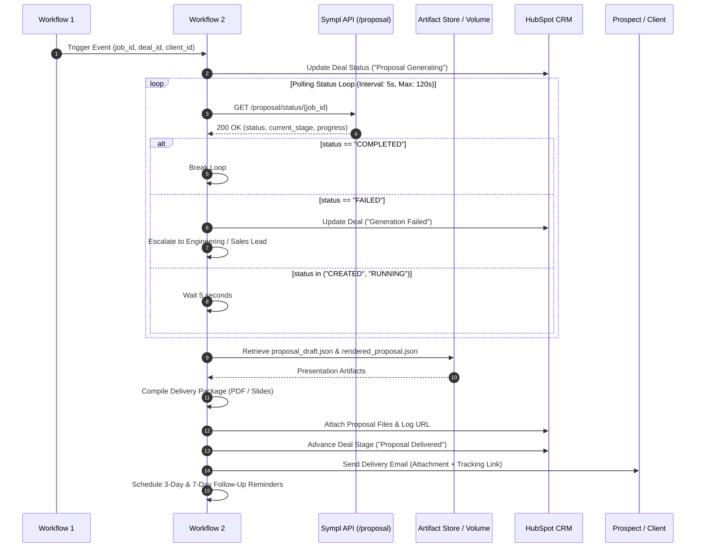

# Sympl Proposal RAG — n8n Automation Architecture Design Layer

## 1. Executive Architecture Overview & System Boundaries

The **Sympl Proposal RAG** platform achieves enterprise-grade reliability and regulatory compliance by maintaining an absolute architectural decoupling between **business process automation** (orchestrated in n8n) and **proposal intelligence** (executed within the Sympl FastAPI/pgvector backend).

```
┌────────────────────────────────────────────────────────────────────────────────────────┐
│                                n8n Orchestration Layer                                 │
│  - Multi-Channel Lead Intake          - AI Unstructured Data Extraction (LangChain)   │
│  - Qualification & Data Enrichment   - Human Approval Gate (Mandatory Firewall)       │
│  - Asynchronous Job Dispatch          - Status Polling & Delivery Automation          │
└───────────────────────────────────────────┬────────────────────────────────────────────┘
                                            │ HTTP (X-API-Key, JSON)
                                            │ POST /proposal/generate/async
                                            ▼
┌────────────────────────────────────────────────────────────────────────────────────────┐
│                            Sympl Backend Intelligence Layer                            │
│  - Scope Interpretation & Firewall    - Precedence Archetype Selection                │
│  - BGE-M3 Dense Semantic Retrieval    - Bounded LLM Generation (Strict Grounding)     │
│  - Anti-Leakage Compliance Guard      - Deterministic Layout Compilation & Rendering  │
└────────────────────────────────────────────────────────────────────────────────────────┘
```

### Strict Responsibility Split

| Domain / Function | n8n Orchestration Layer | Sympl Proposal Backend |
| :--- | :--- | :--- |
| **Lead Capture & Ingestion** | **Primary Owner** (Webhooks, CRM, Forms, Email) | *Out of Scope* (Exposes standard REST API only) |
| **Data Extraction from Unstructured Text** | **Primary Owner** (AI Agent / Structured Outputs) | *Out of Scope* |
| **Lead Qualification & Enrichment** | **Primary Owner** (CRM stages, missing info detection) | *Out of Scope* |
| **Scope Approval & Human Firewall** | **Primary Owner** (Interactive Approval Gates) | **Enforces Barrier** (`approved_scope` mandatory) |
| **Scope Interpretation & Mapping** | *Forbidden* (Passes raw strings/flags through) | **Primary Owner** (`sympl_planner.engine`) |
| **Proposal Archetype Selection** | *Forbidden* (Cannot decide archetype) | **Primary Owner** (Deterministic 5-level precedence) |
| **Reference Chunk Retrieval** | *Forbidden* | **Primary Owner** (BAAI/bge-m3 + PostgreSQL pgvector) |
| **Section Generation & LLM Writing** | *Forbidden* (Cannot draft final proposal text) | **Primary Owner** (`sympl_writer.engine`) |
| **Pricing Validation & Commercial Rules** | *Forbidden* (Captures quotes; cannot alter) | **Primary Owner** (Strict audit & schedule handler) |
| **Document Compilation & Formatting** | *Coordinates Delivery* (Downloads output) | **Primary Owner** (`sympl_renderer.engine`) |
| **Status Polling & Notifications** | **Primary Owner** (Slack, Email, Webhook) | Exposes `GET /proposal/status/{job_id}` |
| **CRM Synchronization** | **Primary Owner** (HubSpot, Salesforce, Airtable) | *Out of Scope* |

> [!CRITICAL]
> **Anti-Pattern Rejection:** Any n8n workflow design that attempts to perform vector similarity search, select proposal archetypes, draft proposal body narrative, infer service inclusions, or bypass human sign-off on `approved_scope` violates core system invariants and must be rejected.

---

## 2. n8n AI Agent Usage Policy

To prevent hallucinations, unauthorized scope creep, and commercial misstatements, AI Agents operating within n8n are strictly sandboxed.

### Visual Governance Boundary

```
  Client Ingestion (Email, Form, Call Transcript)
                        │
                        ▼
  ┌───────────────────────────────────────────┐
  │         AI Extraction Agent (n8n)         │
  │   - Extracts entity names & contacts      │
  │   - Summarizes unstructured requests      │
  │   - Categorizes client industry/sector    │
  │   - Flags missing operational data        │
  └─────────────────────┬─────────────────────┘
                        │ Formats Draft Scope
                        ▼
  ┌───────────────────────────────────────────┐
  │       Human Approval Gate (Mandatory)     │
  │   - Partner / Lead Account Exec Review    │
  │   - Explicitly checks/unchecks services   │
  │   - Confirms commercial rates & billing   │
  │   - Signs off on exclusions & timeline    │
  └─────────────────────┬─────────────────────┘
                        │ Produces validated approved_scope
                        ▼
  ┌───────────────────────────────────────────┐
  │        Sympl Proposal API Backend         │
  │   - Validates approved_scope != empty     │
  │   - Deterministic Archetype Selection     │
  │   - pgvector Historical Retrieval         │
  │   - Writer Engine LLM Generation          │
  └───────────────────────────────────────────┘
```

### Policy Matrix

```
┌───────────────────────────────────┬───────────────────────────────────┬───────────────────────────────────┐
│     A) ALLOWED AI AGENT TASKS     │    B) HUMAN REQUIRED DECISIONS    │   C) BACKEND CONTROLLED ENGINES   │
├───────────────────────────────────┼───────────────────────────────────┼───────────────────────────────────┤
│ • Extract structured contact data │ • Approve billable service scope  │ • Decide proposal archetype       │
│ • Transcribe/summarize calls      │ • Sign off on pricing & retainer  │ • Query pgvector historical chunks│
│ • Detect missing form fields      │ • Approve commercial exclusions   │ • Rank & select style exemplars   │
│ • Classify organization sector    │ • Approve transition timelines    │ • Generate final section prose    │
│ • Draft email updates & reminders │ • Authorize proposal generation   │ • Compile slide/page layout JSON  │
└───────────────────────────────────┴───────────────────────────────────┴───────────────────────────────────┘
```

#### A. Allowed AI Agent Tasks
1. **Unstructured Lead Parsing**: Converting free-form email bodies or web forms into standard JSON schemas (`company_name`, `contact_person`, `sector`, `requested_notes`).
2. **Missing Information Detection**: Comparing parsed fields against intake requirements and highlighting omissions (e.g., missing payroll headcount, undefined target accounting software).
3. **Communication Assistance**: Generating courteous reminder emails to clients for missing details or preparing proposal delivery notification copy.

#### B. Human Required Decisions (The Approval Firewall)
1. **Scope Authorization**: A human Principal or Account Executive must explicitly check the boxes for billable service families (`bookkeeping`, `payroll`, `financial_reporting`, `compliance`, `digital_transformation`, `training`, `transition`).
2. **Commercial Schedule Confirmation**: Explicitly entering or verifying the `monthly_retainer`, `setup_fee`, `hourly_rate`, or confirming placeholder billing.
3. **Exclusion Validation**: Explicitly confirming whether legacy catch-up cleanup is excluded or included.

#### C. Backend Controlled Decisions
1. **Archetype Resolution**: Governed by backend rule priority (`ARCH_COMPACT_BOOKKEEPING`, `ARCH_NONPROFIT_CORE`, `ARCH_DIGITAL_TRANSFORMATION`, etc.).
2. **Historical Exemplar Retrieval**: Mathematical cosine similarity search against frozen embeddings table (`47` active vectors).
3. **Proposal Drafting**: Executed by `sympl_writer` with strict context grounding and zero historical data leakage.

---

## 3. Workflow 1: Lead Intake & Proposal Generation Workflow

### Purpose & Sales Lifecycle Alignment

Workflow 1 manages the end-to-end sales intake process:
$$\text{Lead Received} \longrightarrow \text{Qualification} \longrightarrow \text{Discovery Enrichment} \longrightarrow \text{Audit Check} \longrightarrow \text{Sales Review} \longrightarrow \text{Scope Approval} \longrightarrow \text{API Dispatch}$$



### Lead Ingress Channels — Comparative Evaluation

| Channel / Trigger | Advantages | Disadvantages | Recommendation |
| :--- | :--- | :--- | :--- |
| **1. HubSpot CRM Deal Stage Trigger** | Native CRM synchronization; leverages existing sales pipelines; triggers automatically when deal moves to "Discovery Completed". | Requires HubSpot Sales Hub subscription; slight webhook delay (1-5s). | **Recommended Primary** |
| **2. Typeform / Jotform Webhook** | High data completeness; enforces typed form fields; branching logic for client questions. | Disconnected from CRM conversation history; requires duplicate contact syncing. | **Recommended Secondary** |
| **3. Website Form Webhook** | Low friction; zero licensing cost; direct custom payload to n8n. | Prone to spam; unstructured comments; requires aggressive AI parsing. | Supported Fallback |
| **4. Inbound Email Inquiry Parser** | Zero friction for client; handles conversational email requests directly. | Highly unstructured; high extraction variance; frequent missing fields. | Supporting Channel Only |
| **5. Manual Sales Webhook / Internal Form** | 100% data quality; sales rep controls inputs directly after discovery call. | High manual overhead; slower turnaround time. | Administrative Fallback |

### CRM Integration Options — Evaluation & Selection

1. **HubSpot CRM (Recommended Primary)**:
   - *Reason*: Robust webhook support, built-in deal stages, custom property groups (`sympl_proposal_status`, `sympl_job_id`), and native n8n node integration.
2. **Salesforce Sales Cloud (Secondary Enterprise Option)**:
   - *Reason*: Ideal for large organizations with complex role-based access; higher configuration complexity.
3. **Airtable / Google Sheets (Tertiary / Lightweight Option)**:
   - *Reason*: Low cost and visual ease; lacks enterprise deal lifecycle automation and audit logging.

### Detailed Workflow 1 Stage Execution

1. **Stage 1: Lead Capture**: Ingests payload from HubSpot deal webhook or custom intake webhook.
2. **Stage 2: AI Extraction Layer**: Invokes LangChain structured extractor (using `gpt-4o-mini` or Claude 3.5 Sonnet) to standardize company name, sector, systems, and requested services.
3. **Stage 3: CRM Record Update**: Creates/updates Deal and Company records in HubSpot, setting stage to `Proposal In Review`.
4. **Stage 4: Missing Information Gate**: Executes deterministic validation:
   - Must have: `organization.name`, `organization.sector`, contact email, at least one identified need.
   - If missing: routes to Sales Task assignment and triggers client clarification email.
5. **Stage 5: Mandatory Human Approval Gate**: Halts execution until a designated team member reviews and signs off on the exact service scope and commercial terms.
6. **Stage 6: Asynchronous Backend Dispatch**: Formats `ClientInput` JSON payload and dispatches `POST /proposal/generate/async` to the Sympl backend.
7. **Stage 7: Workflow 2 Handoff**: Calls Workflow 2 webhook with `{ "job_id": "job_...", "deal_id": "...", "client_name": "..." }`.

---

## 4. Human Approval Implementation Blueprint

The Human Approval Gate is the central firewall protecting the Sympl backend from unauthorized scope generation.

```
┌────────────────────────────────────────────────────────────────────────────────────────┐
│                               HUMAN APPROVAL OPTIONS                                   │
├────────────────────────────────┬───────────────────────────────────────────────────────┤
│ Option 1: n8n Form Trigger     │ Standalone responsive web form generated by n8n.     │
│ (Recommended Primary)          │ Directly validates checkboxes and rates.              │
├────────────────────────────────┼───────────────────────────────────────────────────────┤
│ Option 2: Slack Interactive    │ Block Kit message with Approve/Reject buttons and     │
│ (Fastest Turnaround)           │ modal dialog for adjusting scope checkboxes.          │
├────────────────────────────────┼───────────────────────────────────────────────────────┤
│ Option 3: CRM Property Change  │ Deal property "Scope Approved" toggled in HubSpot.    │
│ (Best Audit Trail)             │ Triggered via HubSpot Webhook subscription.           │
├────────────────────────────────┼───────────────────────────────────────────────────────┤
│ Option 4: Signed Email Link    │ Single-use HMAC-signed approval token link.           │
│ (Executive Mobile Access)      │ Dispatches callback upon executive click.             │
└────────────────────────────────┴───────────────────────────────────────────────────────┘
```

### Detailed Option Mechanics

#### Option 1: n8n Form Trigger / Webhook Resume (Recommended Primary)
- **How `approved_scope` is created**: n8n presents an authenticated web form pre-filled with the AI-extracted `requested_scope`. The Account Executive reviews checkboxes for each service family (`Bookkeeping`, `Payroll`, `Reporting`, `Compliance`, `Transformation`, `Training`, `Transition`) and enters agreed commercial fees (`monthly_retainer`, `setup_fee`).
- **How workflow resumes**: Submitting the form releases an n8n `Wait for Webhook` node, passing the validated `approved_scope` dictionary into the execution context.
- **Tampering prevention**: Form submission requires session authentication; input schema is strictly validated against `sympl_planner.schema.ScopeContainer` before dispatch.

#### Option 2: Slack / Teams Interactive Block Kit
- **How `approved_scope` is created**: A formatted Slack message is posted to `#proposals-approval` with lead summary and "Configure & Approve" action button opening a Slack Modal.
- **How workflow resumes**: Slack webhook sends interaction payload to n8n Webhook resume URL.
- **Tampering prevention**: n8n validates Slack HMAC request signature (`X-Slack-Signature`) and enforces permitted user IDs.

#### Option 3: HubSpot CRM Property Approval
- **How `approved_scope` is created**: Custom multi-checkbox property in HubSpot: `Sympl Approved Services` (Bookkeeping, Payroll, etc.) and currency fields.
- **How workflow resumes**: HubSpot webhook fires on property change `Proposal Approval Status = Approved`.
- **Tampering prevention**: HubSpot field permissions limit edits to members of the Sales Management team.

#### Option 4: Signed Email Webhook Callback
- **How `approved_scope` is created**: Email dispatched to Partner with review summary and two buttons ("Approve Default Scope" or "Edit in Portal").
- **How workflow resumes**: Clicking the link calls an n8n webhook with a cryptographic JWT or HMAC token.
- **Tampering prevention**: Tokens expire within 72 hours; replay protection ensures each token can be submitted only once.

---

## 5. Workflow 2: Proposal Processing, Monitoring, & Delivery

### Purpose & Architecture

Workflow 2 handles the asynchronous lifecycle once a job has been accepted by the Sympl Proposal RAG worker:
$$\text{Receive job\_id} \longrightarrow \text{Polling Loop} \longrightarrow \text{Retrieve Artifacts} \longrightarrow \text{Format Output} \longrightarrow \text{CRM Update} \longrightarrow \text{Client Delivery} \longrightarrow \text{Follow-up Sequence}$$



### Document Delivery Architecture & Adapter Priority

The delivery engine adheres to a strict 3-tier priority sequence:

```
┌────────────────────────────────────────────────────────────────────────┐
│                        DELIVERY ADAPTER PRIORITY                       │
├────────────────────────────────────────────────────────────────────────┤
│ Priority 1: Direct JSON Artifacts (Core Contract - Available Now)      │
│ - proposal_plan.json (Archetype, confidence, retrieval lineage)        │
│ - proposal_draft.json (Complete structured sections, markdown, CTA)    │
│ - rendered_proposal.json (Presentation layout, page budget, cards)     │
├────────────────────────────────────────────────────────────────────────┤
│ Priority 2: Deterministic PDF Generation (Primary Business Output)     │
│ - Compiled via Headless Chromium / Weasyprint / Gotenberg from HTML    │
│ - Zero external dependencies; instant attachment to CRM and Email      │
├────────────────────────────────────────────────────────────────────────┤
│ Priority 3: Canva Integration (Optional Presentation Adapter)          │
│ - Abstracted in sympl_renderer; requires enterprise OAuth credentials │
│ - Optional add-on when Canva Brand Template is configured             │
└────────────────────────────────────────────────────────────────────────┘
```

| Delivery Option | Format | Advantages | Disadvantages | Recommendation |
| :--- | :--- | :--- | :--- | :--- |
| **Option A: Headless PDF** | Clean PDF Document | Universal compatibility; read-only security; direct CRM and email attachment. | Static layout; no interactive browser editing. | **Recommended Primary** |
| **Option B: Canva Presentation** | Live Canva Deck URL | High visual polish; editable by sales team; dynamic brand kits. | External cloud dependency; Canva API rate limits; OAuth token rotation. | Optional Adapter (Priority 3) |
| **Option C: CRM Document Portal** | Web Preview URL | Real-time page view analytics; e-signature capability (HubSpot Quotes / PandaDoc). | Requires portal configuration and client login/link tracking. | Secondary Option |
| **Option D: Direct Raw Artifacts** | JSON Schema Bundle | Complete transparency for downstream custom rendering or n8n parsing. | Not client-facing; requires front-end or converter. | Internal Audit & Archival |

### Artifact Storage Retrieval Design

Because n8n operates in an independent container or cloud instance, it **must not** rely on local filesystem paths (`/app/data/...`). Artifact retrieval is designed across three cloud-compatible patterns:

1. **Option A: API Artifact Retrieval Endpoint (Recommended Standard)**:
   - Backend exposes authenticated endpoint: `GET /proposal/{proposal_id}/artifacts` or `GET /proposal/{proposal_id}/download/{artifact_name}`.
   - n8n performs standard authenticated HTTP GET requests with `X-API-Key` to download JSON or rendered binaries directly into binary workflow memory.
2. **Option B: Object Storage Pre-Signed URLs (S3 / Cloudflare R2 / GCS)**:
   - When the backend completes generation, `sympl_storage.S3ArtifactStore` uploads outputs to private cloud buckets and writes pre-signed download URLs (`expires_in=3600`) to the job metadata.
   - n8n downloads directly from S3 using these temporary pre-signed links.
3. **Option C: Webhook Callback with Payload / Volume Share**:
   - In shared Docker Compose environments, both n8n and Sympl services mount the shared volume `sympl_proposal_shared_artifacts` at `/data/proposals`.
   - In Railway or distributed clouds, Option A or Option B is used exclusively.

---

## 6. API Contracts Documentation

All n8n HTTP Request nodes must strictly conform to the existing Sympl Proposal Production API.

### 1. Endpoint: `POST /proposal/generate/async`

Initiates the asynchronous proposal generation pipeline. Returns immediately with `job_id`.

#### Request Headers
```http
POST /proposal/generate/async HTTP/1.1
Host: sympl-api-production.up.railway.app
Content-Type: application/json
X-API-Key: {{$env.SYMPL_API_KEY}}
X-Request-ID: req_n8n_lead_10482
```

#### Request Body Schema (`ClientInput` Representation)
```json
{
  "client_id": "client_high_park_hub",
  "organization": {
    "name": "High Park Community Hub",
    "organization_type": "nonprofit",
    "sector": "community_services",
    "description": "Multi-program community agency providing food security, youth programs, and community sports.",
    "current_systems": ["QuickBooks Desktop", "Manual Excel Spreadsheets"],
    "target_systems": ["QuickBooks Online", "Plooto", "Dext"]
  },
  "engagement": {
    "engagement_type": "recurring",
    "complexity": "standard",
    "fixed_term_duration": null,
    "diagnostic_focus": ["internal_controls", "audit_readiness"]
  },
  "requested_scope": {
    "bookkeeping": {
      "cadence": "monthly",
      "ap_ar": true,
      "reconciliations": true,
      "expense_management": true,
      "catchup_cleanup": true
    },
    "payroll": {
      "cadence": "semi_monthly",
      "headcount_employees": 14,
      "headcount_contractors": 4,
      "sympl_processes_payroll": true
    }
  },
  "approved_scope": {
    "bookkeeping": {
      "cadence": "monthly",
      "ap_ar": true,
      "reconciliations": true,
      "expense_management": true,
      "catchup_cleanup": false
    },
    "payroll": {
      "cadence": "semi_monthly",
      "headcount_employees": 14,
      "headcount_contractors": 4,
      "sympl_processes_payroll": true
    }
  },
  "commercial_terms": {
    "pricing_model": "fixed_retainer",
    "currency": "CAD",
    "monthly_retainer": 2400.0,
    "setup_fee": 1500.0,
    "billing_schedule": "monthly_in_advance",
    "include_backlog_exclusion": true,
    "software_fees_excluded": true
  },
  "preferences": {
    "include_why_us": true,
    "is_competitive_pitch": false,
    "is_trusted_continuity": true,
    "identity_credential_preference": "community_social"
  }
}
```

> [!IMPORTANT]
> **Scope Invariant**: `requested_scope` is transmitted strictly for historical audit and exclusion logging. The backend engine **exclusively** uses `approved_scope` for Archetype Selection and section generation. If `approved_scope` is missing or empty, the API returns HTTP 400 (`APPROVAL_REQUIRED` or `EMPTY_APPROVED_SCOPE`).

#### Response Schema (HTTP 200 OK)
```json
{
  "job_id": "job_5343d3c5009b",
  "status": "CREATED",
  "request_id": "req_n8n_lead_10482",
  "message": "Proposal generation job queued successfully."
}
```

---

### 2. Endpoint: `GET /proposal/status/{job_id}`

Polled by n8n Workflow 2 to track pipeline progression.

#### Request Headers
```http
GET /proposal/status/job_5343d3c5009b HTTP/1.1
Host: sympl-api-production.up.railway.app
X-API-Key: {{$env.SYMPL_API_KEY}}
```

#### Response Schema (HTTP 200 OK)
```json
{
  "job_id": "job_5343d3c5009b",
  "status": "RUNNING",
  "current_stage": "WRITER",
  "progress": 0.33,
  "proposal_id": "prop_56f02c7bbd8a",
  "error_message": null
}
```

#### Lifecycle State Progression
1. `CREATED` / `QUEUED` (`progress: 0.0`): Job registered in operational database; awaiting worker pickup.
2. `RUNNING` / `PLANNER` (`progress: 0.1`): Proposal Planner resolving archetype, pgvector retrieval, and scope exclusions.
3. `RUNNING` / `WRITER` (`progress: 0.33`): Proposal Writer compiling section content via LLM and grounding rules.
4. `RUNNING` / `RENDERER` (`progress: 0.66`): Presentation layout compilation and card formatting.
5. `COMPLETED` / `COMPLETED` (`progress: 1.0`): All artifacts generated, verified, and saved to store.
6. `FAILED` / `FAILED` (`progress: 0.0`): Execution error; details populated in `error_message`.

---

## 7. Production Error Handling & Escalation Matrix

Enterprise automation requires deterministic error boundaries for all failure modes:

| Failure Mode | Detection Trigger in n8n | Retry Strategy | Automated Action | Human Escalation |
| :--- | :--- | :--- | :--- | :--- |
| **1. Missing `approved_scope`** | Pre-flight validation node detects empty scope or HTTP 400 `APPROVAL_REQUIRED`. | No retry (deterministic policy error). | Halt Workflow 1; log audit event in CRM. | Slack alert to Sales Rep: *"Proposal blocked: Scope sign-off missing."* |
| **2. API Unavailable / Network Timeout** | HTTP Request node returns 502/503/504 or times out after 10s. | Exponential backoff: 3 retries (5s, 15s, 30s). | If all retries fail, mark job as `API_OFFLINE`. | High-priority PagerDuty / Slack alert to DevOps team. |
| **3. API Authentication Failure** | HTTP Request node returns 401 `UNAUTHORIZED`. | No retry (credential error). | Halt workflow immediately; quarantine lead. | Security alert to Systems Admin: *"Sympl API Key invalid or expired."* |
| **4. Proposal Generation FAILED** | Status polling endpoint returns `status == "FAILED"`. | No automatic regeneration (prevents token burn). | Log `error_message` directly to HubSpot Deal Note. | Escalation to Lead Proposal Architect with error stack trace. |
| **5. Worker Daemon Unavailable** | Job remains in `CREATED` / `QUEUED` state for > 60 seconds. | Continue polling up to max timeout (120s). | Mark job `WORKER_TIMEOUT`. | Slack alert to Engineering: *"Proposal Worker queue stalled."* |
| **6. Storage / Artifact Retrieval Failure** | Download endpoint or S3 URL returns 404 or connection error. | 2 retries at 10s interval. | Retain `proposal_id` in CRM; log retrieval failure. | Notify Systems Admin to inspect storage volume / bucket permissions. |
| **7. CRM Update Failure** | HubSpot API returns 429 (Rate Limit) or 500. | Retry with jitter: 4 retries up to 60s. | Buffer payload in n8n execution memory. | Notify Sales Ops if CRM remains unreachable. |
| **8. Email Delivery Failure** | SMTP node / SendGrid returns bounce or invalid address. | 1 retry after 30s. | Flag contact in CRM as `Email Delivery Failed`. | Assign task to Account Exec to verify prospect email. |

---

## 8. Security, Secrets, & Data Governance

1. **Credential Vault Isolation**:
   - Zero hardcoded API keys or bearer tokens within workflow JSON.
   - All external keys reference n8n encrypted credentials or environment variables:
     - Sympl API Key: `{{$env.SYMPL_API_KEY}}`
     - HubSpot CRM Token: `{{$env.HUBSPOT_ACCESS_TOKEN}}`
     - Slack Webhook URL: `{{$env.SLACK_WEBHOOK_URL}}`
     - SMTP Credentials: `{{$env.SMTP_PASSWORD}}`
2. **Webhook Cryptographic Authentication**:
   - Ingress webhooks validate incoming requests using HMAC SHA-256 signatures (`X-HubSpot-Signature` or custom token `X-Sympl-Webhook-Secret`).
3. **Transport Security**:
   - Enforce TLS 1.3 / HTTPS on all endpoints (`sympl-api-production.up.railway.app`).
4. **Client PII Minimization**:
   - Only necessary client engagement data is transmitted. Sensitive banking details or employee SIN/SSN numbers are explicitly rejected at the extraction layer.
5. **Role-Based Scope Integrity**:
   - Sales reps can suggest requested scope, but only authorized Principals can issue the cryptographic approval token that populates `approved_scope`.

---

## 9. Recommended Production Technology Stack

To achieve maximum stability, minimal maintenance overhead, and seamless integration with the Sympl Proposal RAG backend, the following production stack is recommended:

```
┌───────────────────────────┬───────────────────────────────────┬────────────────────────────────────────────────────────┐
│ COMPONENT                 │ RECOMMENDED TECHNOLOGY            │ ARCHITECTURAL RATIONALE                                │
├───────────────────────────┼───────────────────────────────────┼────────────────────────────────────────────────────────┤
│ Lead Ingress & CRM        │ HubSpot CRM (Sales Hub)           │ Native deal stages, webhooks, custom properties, and   │
│                           │                                   │ turnkey two-way synchronization with n8n.              │
├───────────────────────────┼───────────────────────────────────┼────────────────────────────────────────────────────────┤
│ Orchestration Platform    │ n8n Self-Hosted (Railway / Cloud) │ Low operational cost, native LangChain nodes, private  │
│                           │                                   │ network connectivity to Sympl API and PostgreSQL.      │
├───────────────────────────┼───────────────────────────────────┼────────────────────────────────────────────────────────┤
│ AI Extraction Model       │ OpenAI GPT-4o-mini / Claude 3.5   │ High JSON adherence, rapid latency (<1.5s), and        │
│                           │ Haiku (via LangChain in n8n)      │ minimal cost for structured entity extraction.         │
├───────────────────────────┼───────────────────────────────────┼────────────────────────────────────────────────────────┤
│ Human Approval Mechanism  │ n8n Form Trigger / Slack BlockKit │ Zero friction for sales leaders; interactive checks;   │
│                           │                                   │ impossible to bypass programmatically.                 │
├───────────────────────────┼───────────────────────────────────┼────────────────────────────────────────────────────────┤
│ Primary Document Output   │ Deterministic Headless PDF        │ Consistent visual presentation across all devices;     │
│                           │ (Compiled from Rendered JSON)     │ immutable commercial proposal for signature.           │
├───────────────────────────┼───────────────────────────────────┼────────────────────────────────────────────────────────┤
│ Presentation Adapter      │ Canva Brand Template (Optional)   │ Available as optional aesthetic enhancement; decoupled │
│                           │                                   │ so core proposal delivery never depends on Canva API.  │
└───────────────────────────┴───────────────────────────────────┴────────────────────────────────────────────────────────┘
```
